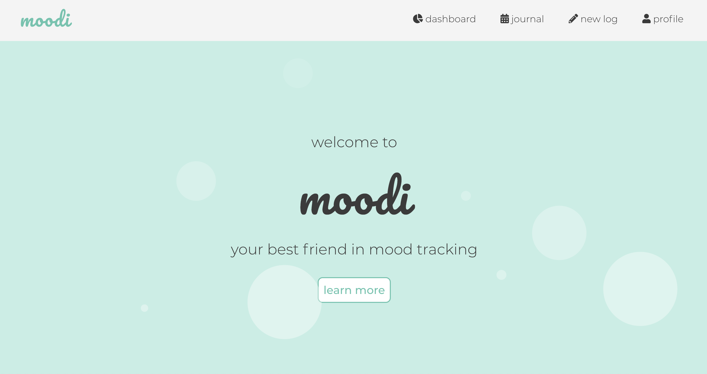
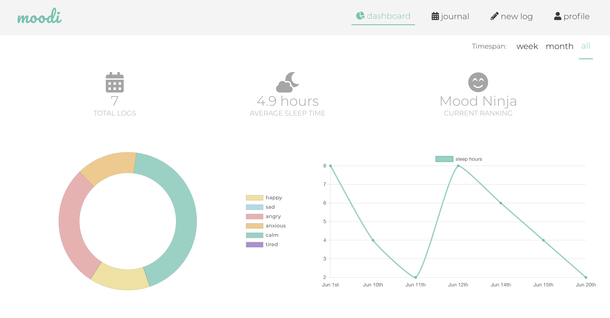
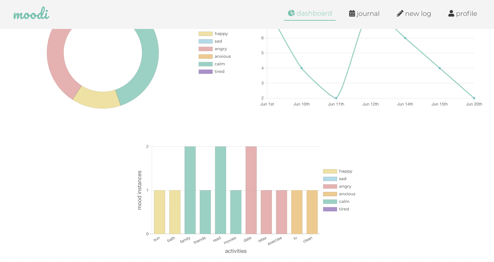
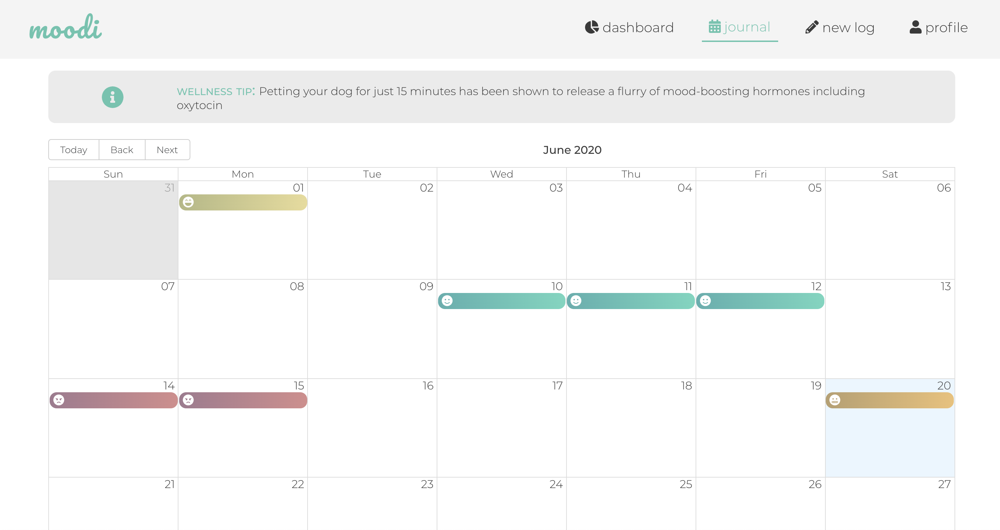
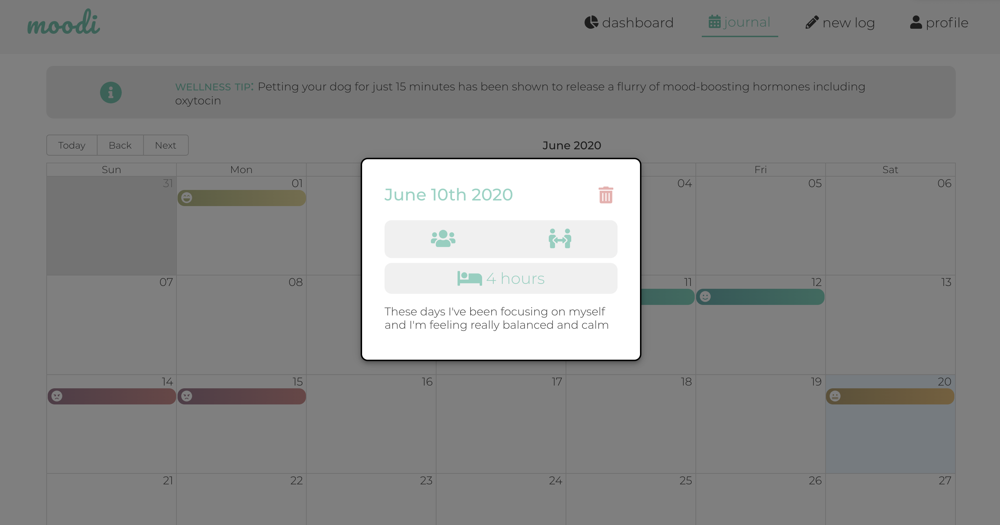
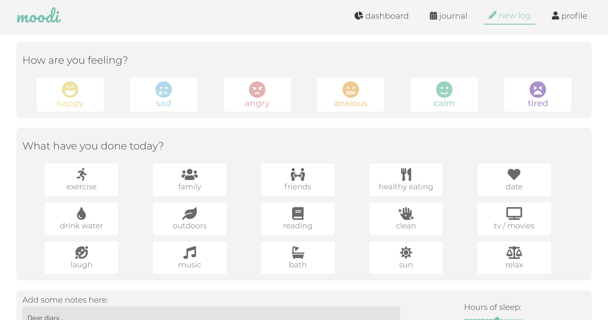

# Moodi

Moodi is a versatile app that takes the effort out of keeping a mood journal all while allowing you to track your mood and the different factors that lead to your ups and downs.

Here are some of the perks:
  - Quickly take note of how you felt during a particular day
  - No need to write anything if you don't want to - our quick-tap buttons will help you out
  - Look through your very own journal of mood logs for your own complete history
  - Take a peek at your personalized dashboard to see stats and figures from your recent moods

## Demo

A demo version is available [here](https://moodi.now.sh/).

Please note that this demo version is intended for demo purposes only. For security reasons, we do not recommend that you sign up as a new user using your own personal information.

## Installation

Simply clone the repo and run ```npm i```
The client is already connected to a remotely deployed server. 
A modifiable version can be found [here](https://github.com/ailsamm/moodi-server) (simply clone, run ```npm i``` and then, in this app, change the URL in the ./src/config.js) or work with the already-deployed version that is specified in ./src/config.js.

## Tech Stack
Moodi is written with ReactJS, Javascript, HTML5, CSS3.

## Usage
See the following screenshots for an overview of how Moodi can be used.












